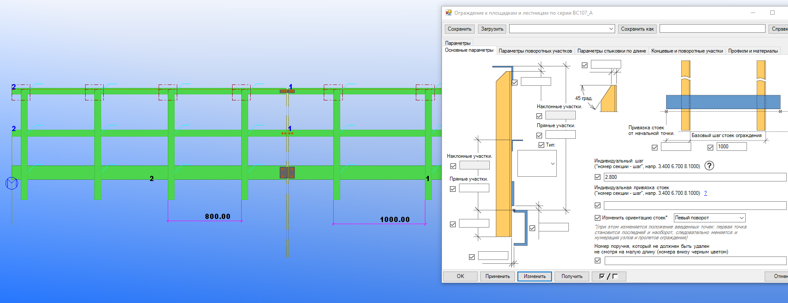

# Индивидуальный шаг секций ограждения.

Данное меню служит для задания индивидуального шага секции ограждения по её порядковому номеру.

## Порядок задания. Текстовая версия.

Следуйте по следующим шагам:

1. Постройте плагином необходимые секции ограждения.
2. Определите номер секции ограждения, шаг стоек которой необходимо изменять (см. рис. 1).
3. Введите номер секции ограждения, точку, после точки требуемый шаг стоек секции ограждения. Например: 3.400 (см. рис. 2).
4. Вводить данные параметры можно сразу для нескольких секций. Индивидуальные настройки шагов секций должны быть разделены пробелом. Например: 3.400 6.700 10.900.
5. Порядок ввода номеров секций не важен.

Рис. 1.

Рис. 2.

## Порядок задания. Видеоверсия.