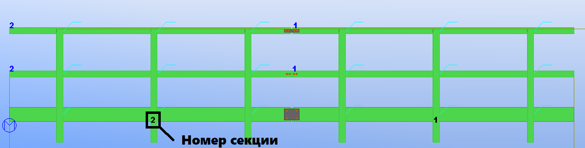

# Ограждение к площадкам и лестницам по серии ВС107-А

[TOC]

## Основные геометрические параметры.

Текст.

## Задание индивидуального шага стоек.

Данное меню служит для задания индивидуального шага секции ограждения по её порядковому номеру.

### Порядок задания. Текстовая версия.

Следуйте по следующим шагам:

1. Постройте плагином необходимые секции ограждения.
2. Определите номер секции ограждения, шаг стоек которой необходимо изменять (см. рис. 2.1).
3. Введите номер секции ограждения, точку, после точки требуемый шаг стоек секции ограждения. Например: 3.400 (см. рис. 2.2).
4. Вводить данные параметры можно сразу для нескольких секций. Индивидуальные настройки шагов секций должны быть разделены пробелом. Например: 3.400 6.700 10.900.
5. Порядок ввода номеров секций не важен.

Рис. 2.1.

Рис. 2.2.

## Задание индивидуальной привязки стоек.

Текст.

## Изменение ориентации ограждения.

Текст.

## Удаление коротких поручней.

Текст.

## Стык поручней ограждения 90 градусов.

Текст.

## Перегиб поручней ограждения.

Текст.

## Смещение коротких участков поручней при внутреннем повороте ограждения.

Текст.

## Стык поручней при помощи подрезки.

Текст.

## Стык поручней ограждения по длине.

Текст.

## Стык предохранительной полосы по длине.

Текст.

## Перегиб предохранительной полосы.

Текст.

## Стык предохранительной полосы 90 градусов.

Текст.

## Регулирование концевых участков.

Текст.

## Длина при которой между точками вставки плагина создаются узлы.

Текст.

## Минимальная длина созданных поручней.

Текст.