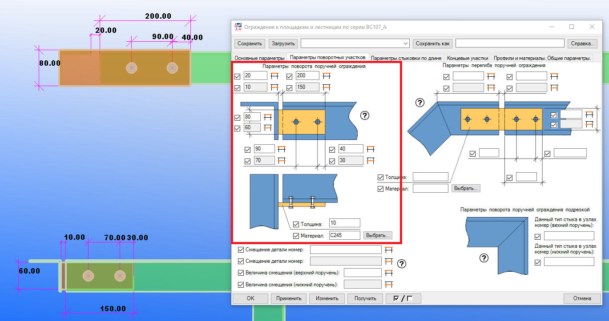
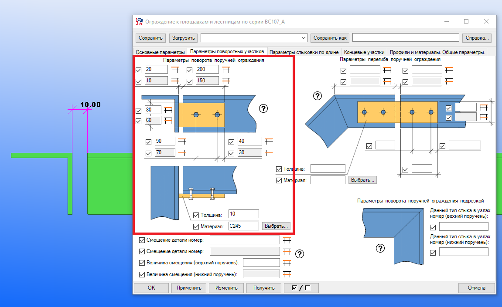
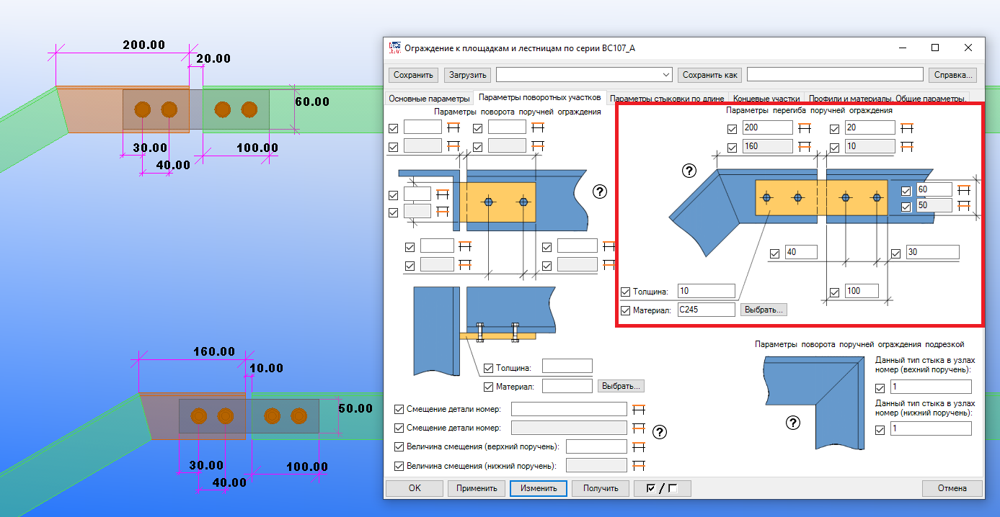
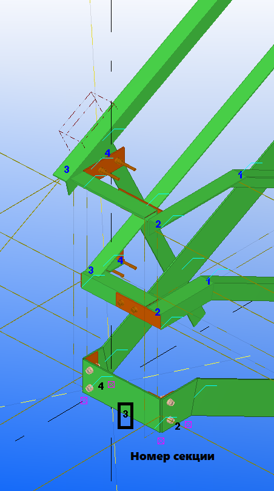
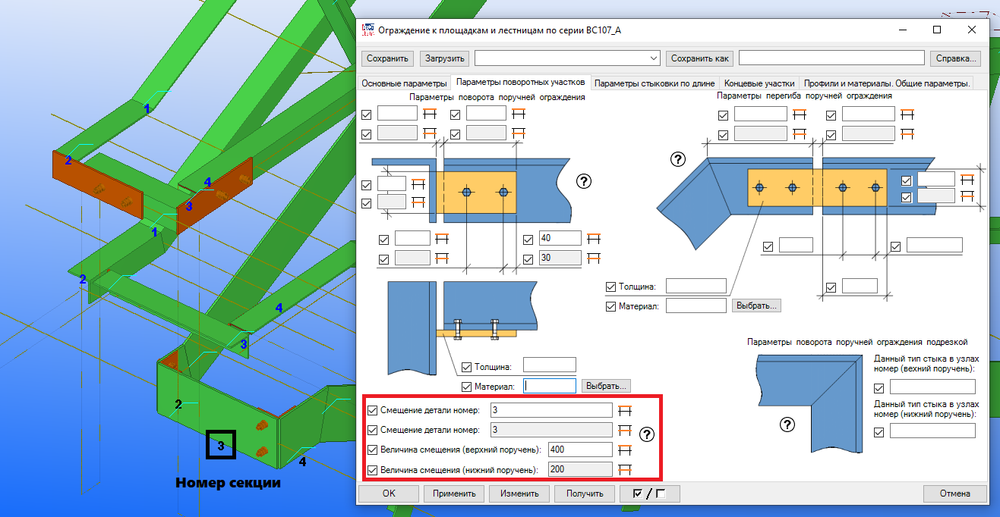
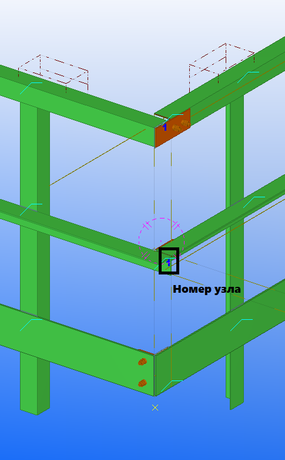
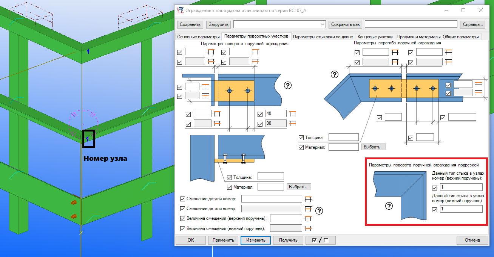
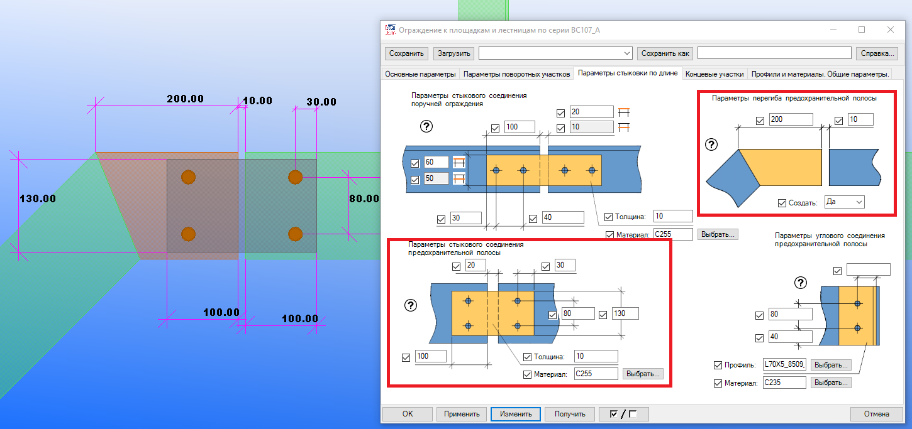
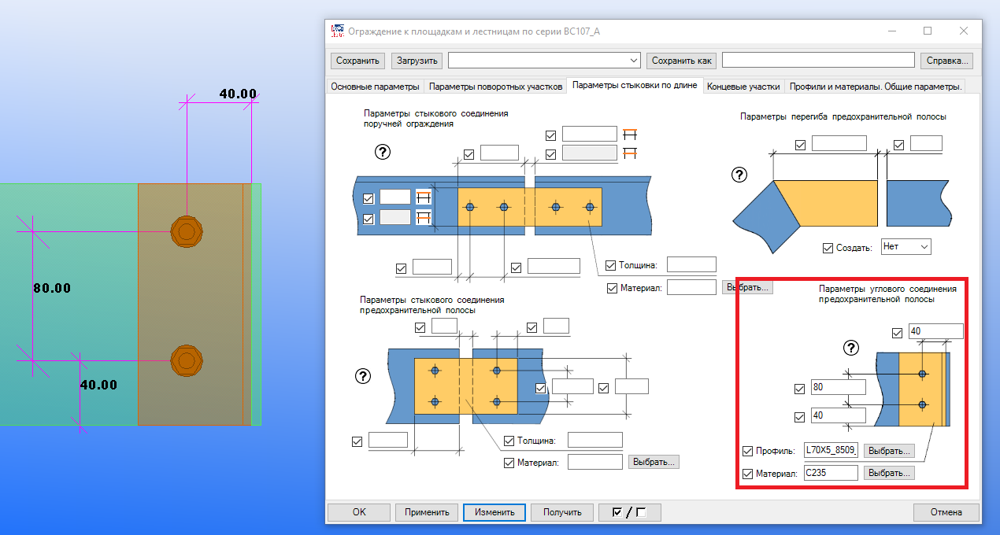
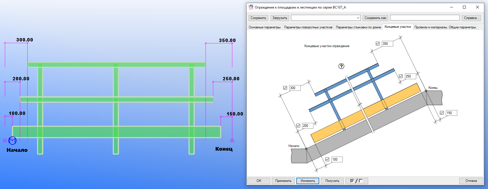

[TOC]

# Ограждение к площадкам и лестницам по серии ВС107-А.

Плагин позволяет автоматически расставлять секции ограждений.

Плагин предназначен для крепления ограждений следующего сечения:

- Первый и второй поручни – уголок равнополочный по ГОСТ 8509-93.
- Отбортовочная полоса – полоса или лист PL.
- Стойки ограждения – уголок равнополочный ГОСТ 8509-93.

Версия программы – 21.0 2017..2019i.

## 1. Основные геометрические параметры.

Данное меню служит для задания базовых настроек ограждения (высоты, привязки поручней, базового шага стоек и т.д.).

1. Основные базовые параметры задаются в стартовом окне плагина. Ими являются общая высота ограждения, привязка уровня нижнего поручня и его ориентация, горизонтальная и вертикальная привязка к точкам вставки плагина.
2. Отдельно вынесены высота ограждения и привязка нижнего поручня для наклонных участков ограждения (см .рис 1.1.) и данные настройки применяются для участков ограждения, которые имеют уклон более 10 градусов.
3. Базовый шаг стоек ограждения задается универсальным, для всех построенных секций ограждения и в дальнейшем может быть изменен индивидуально для каждой отдельной секции (см. п. 2).
4. Базовая привязка стартовой стойки секции ограждения задается универсальной, для всех построенных секций ограждения и в дальнейшем может быть изменена индивидуально для каждой отдельной секции (см. п. 3).


Рис. 1.1.

## 2. Задание индивидуального шага стоек.

Данное меню служит для задания индивидуального шага секции ограждения по её порядковому номеру.

### Порядок задания.

Следуйте по следующим шагам:

1. Постройте плагином необходимые секции ограждения.
2. Определите номер секции ограждения, шаг стоек которой необходимо изменять (см. рис. 2.1).
3. Введите номер секции ограждения, точку, после точки требуемый шаг стоек секции ограждения. Например: 3.400 (см. рис. 2.2).
4. Обновите плагин.
5. Вводить данные параметры можно сразу для нескольких секций. Индивидуальные настройки шагов секций должны быть разделены пробелом. Например: 3.400 6.700 10.900.
6. Порядок ввода номеров секций не важен.


Рис. 2.1.


Рис. 2.2.

## 3. Задание индивидуальной привязки стоек.

Данное меню служит для задания индивидуальной стартовой привязки стоек ограждения в соответствии с номером секции.

### Действия.

Следуйте по следующим шагам:

1. Постройте плагином необходимые секции ограждения.

2. Определите номер секции ограждения, стартовый шаг стоек которой необходимо изменять (см. рис. 3.1).

3. Введите номер секции ограждения, точку, после точки требуемую стартовую привязку стоек секции ограждения. Например: 3.400 (см. рис. 2.2).

4. Вводить данные параметры можно сразу для нескольких секций. Индивидуальные настройки шагов секций должны быть разделены пробелом. Например: 3.400 6.700 10.900.

5. Порядок ввода номеров секций не важен.

   

   Рис.3.1.

   

   Рис.3.2.

   

## 4. Изменение ориентации ограждения.

Данное меню служит для изменения ориентации секций ограждения (см. рис. 4.1. и 4.2).

### Действия.

После построения секций ограждения необходимо убедиться в правильности их ориентации (стороны, в которую развернуты поручни и предохранительная полоса).

Данная настройка позволяет изменять ориентацию построенного ограждения. При этом все веденные точки ограждения меняют свой порядок на обратный, что соответственно ведет к изменению номеров секций ограждений, а также узлов.

В меню выбора есть два параметра "Правый поворот" и "Левый поворот". Случаем по умолчанию является первый вариант.

**Внимание!** 

```
Данную настройку желательно применять до внесения прочих изменений, так как после смены ориентации ограждения потребуются изменения во все ранее введенные индивидуальные настройки элементов ограждения.
```


Рис. 4.1.


Рис. 4.2.

## 5. Удаление коротких поручней.

Текст.

## 6. Стык поручней ограждения 90 градусов.

Данное меню служит для задания параметров стыка поручней ограждения под 90 градусов.

### Действия.

Настройки плагина позволяют регулировать:

1. Привязку болтов к краю стыковочной пластины, а также шаг болтов по горизонтали. Позиционирование болтов по вертикали выполнено таким образом, что они от центрованы по стыковочной пластине.
2. По вертикали болты привязываются к наружной грани стыковочной пластины.
3. Настройки позволяют регулировать профиль и материал стыковочной пластины.
4. Если высота уголка нижнего поручня принимается 40 мм и менее (профиль L40 и менее), то стыковочная планка не создаётся и поручни стыкуют только регулированием подрезки (см. рис. 6.3).



Рис. 6.1.


Рис 6.2.



Рис 6.3.

## 7. Перегиб поручней ограждения.

Данное меню служит для задания параметров перегиба поручней ограждения.

### Действия.

Настройки плагина позволяют регулировать:

1. Зазор между стыкуемыми поручнями.
2. Привязку болтов к краю стыковочной планки, а также шаг болтов по горизонтали. Позиционирование болтов по вертикали выполнено таким образом, что центр группы болтов совмещен с центром стыковочной планки.
3. Регулировать длину стыковочной планки, ее высоту, толщину и материал.
4. Если высота уголка нижнего поручня принимается 40 мм и менее (профиль L40 и менее), то стыковочная планка не создаётся и поручни стыкуют только регулированием подрезки (см. рис. 7.2.).
5. Поле ввода белого цвета предназначено для верхних поручней ограждения, серого цвета - для нижних поручней ограждения.



Рис. 7.1.


Рис. 7.2.

## 8. Смещение коротких участков поручней при внутреннем повороте ограждения.

Данное меню служит для формирования правильной геометрии ограждения при построении внутреннего участка ограждения лестничных маршей.

### Действия.

1. После построения внутреннего поворота лестничных ограждений, первоначально может быть сформирована геометрия, не позволяющая верно построить узлы соединения поручней (см. рис. 8.1).
2. Для того, чтобы сместить короткий участок ограждения, необходимо указать его номер, а также величину смещения (см. рис. 8.2.).
3. Отдельно указываются номера узлов и значение смещения для нижних и верхних профилей.
4. Номера секций могут быть указаны через пробел. Например: 3 5 9 10.
5. Порядок ввода номеров узлов не важен.
6. Параметры смещения принимаются равными для всех указанных в этом разделе секций.



Рис. 8.1.



Рис. 8.2.

## 9. Стык поручней при помощи подрезки.

Данное меню служит для задания индивидуального стыка, в виде подрезки двух поручей но номеру узла.

### Действия.

Следуйте по следующим шагам:

1. Постройте плагином необходимые секции ограждения.
2. Определите номер узла, в котором необходимо задать данный тип стыка (см. рис. 9.1).
3. Введите номер узла. Например: 1 (см. рис. 9.2). Отдельно вводятся номера узлов для верхних и нижних поручней. 
4. Обновите плагин.
5. Вводить данные параметры можно сразу для нескольких узлов. Номера узлов необходимо вводить через пробел, например: 1 5 9 10.
6. Порядок ввода номеров узлов не важен.



Рис. 9.1.



Рис. 9.2.

## 10. Стык поручней ограждения по длине.

Данное меню служит для задания параметров стыка поручней ограждения по длине.

### Действия.

Настройки плагина позволяют регулировать:

1. Зазор между стыкуемыми поручнями.
2. Привязку болтов к краю стыковочной планки, а также шаг болтов по горизонтали. Позиционирование болтов по вертикали выполнено таким образом, что центр группы болтов совмещен с центром стыковочной планки.
3. Регулировать длину стыковочной планки, ее высоту, толщину и материал.
4. Если высота уголка нижнего поручня принимается 40 мм и менее (профиль L40 и менее), то стыковочная планка не создаётся и поручни стыкуют только регулированием подрезки (см. рис. 10.2.).
5. Поле ввода белого цвета предназначено для верхних поручней ограждения, серого цвета - для нижних поручней ограждения.


Рис. 10.1.


Рис. 10.2.

## 11. Стык предохранительной полосы по длине.

Данное меню служит для задания параметров стыка предохранительной полосы по длине.

### Действия.

Настройки плагина позволяют регулировать:

1. Зазор между стыкуемыми предохранительными планками.
2. Привязку болтов к краю стыковочной планки, а также шаг болтов по вертикали. Позиционирование болтов по вертикали выполнено таким образом, что центр группы болтов совмещен с центром стыковочной планки.
3. Регулировать длину стыковочной планки, ее высоту, толщину и материал.
4. Поле ввода белого цвета предназначено для верхних предохранительных планок, серого цвета - для нижних предохранительных планок.


Рис. 11.1.

## 12. Перегиб предохранительной полосы.

Данное меню служит для задания параметров перегиба предохранительной полосы.

### Действия.

1. По умолчанию стык предохранительных полос при перегибе строится только при помощи подрезки встык (см. рис. 12.1).
2. При выборе в меню "Создать" данного узла пункта "Да", узел стыковки будет выполнен при помощи короткого прямого участка, состыкованного с наклонной предохранительной полосой встык.
3. Прямой участок стыка в свою очередь соединятся с прямым участком при помощи стыковочной планки. Настройки которой берутся из узла стыковки предохранительных планок по длине (см. п. 11)
4. Плагин позволяет регулировать длину прямого стыковочного участка, а также зазор, между их и прямым участком ограждения (см. рис. 12.2).


Рис. 12.1.



Рис. 12.2.

## 13. Стык предохранительной полосы 90 градусов.

Данное меню служит для задания параметров стыка предохранительной полосы под 90 градусов.

### Действия.

Настройки плагина позволяют регулировать:

1. Привязку болтов к краю стыковочного уголка, а также шаг болтов по вертикали. Позиционирование болтов по вертикали выполнено таким образом, что задается привязка к нижнему краю стыковочного уголка.
2. По горизонтали болты привязываются к наружной грани уголка.
3. Настройки позволяют регулировать профиль и материал стыковочного уголка.
4. Длина уголка равна высоте предохранительной планки.



Рис. 13.1.


Рис 13.2.

## 14. Регулирование концевых участков.

Данное меню служит для задания привязок стартовых и конечных участков поручней ограждения, а также предохранительной полосы.

### Действия.

1. После построения плагина можно указать отступы подрезок стартовых и конечных поручней и предохранительных полос.
2. Расстояние задается от точек вставки плагина (см. рис. 14.1).
3. При задании отрицательных значений, подрезка будет размещена в противоположную от точки вставки сторону.



Рис. 14.1.

## 15. Длина при которой между точками вставки плагина создаются узлы.

Текст.

## 16. Минимальная длина созданных поручней.

Текст.